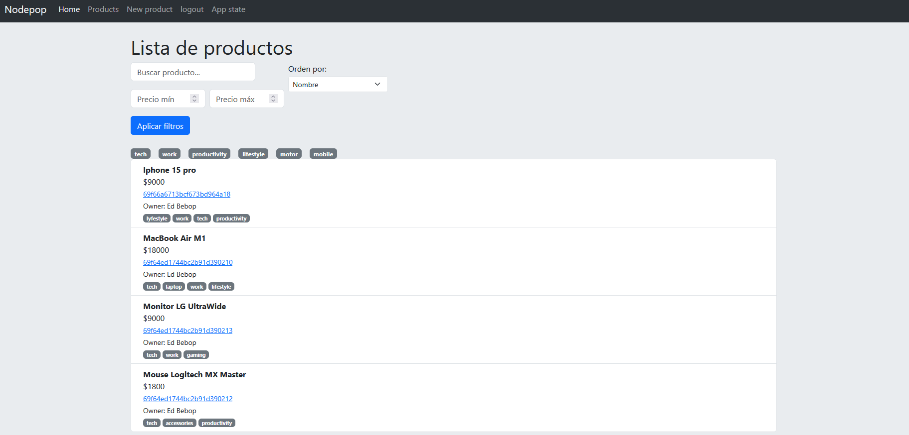

# APP Backend con interfaz gráfica




Desarrollo de aplicación backend con interfaz gráfica para comprender a profundidad la comunicación cliente-servidor, el funcionamiento de HTTP y la construcción de APIs siguiendo el patrón MVC (Modelo-Vista-Controlador).

La aplicación permite gestionar productos a través de endpoints que soportan filtrado, ordenamiento y paginación.
---

##  Tecnologías utilizadas

- Node.js + Express  
- MongoDB Atlas + Mongoose  
- EJS para renderizado de vistas
- Bootstrap
---

##  Flujo de la aplicación

petición → middleware → rutas → controlador → repositorio (BD) → respuesta → vista (EJS)

---

##  Funcionalidades implementadas

- CRUD de productos  
- Filtros por tag, nombre y rango de precio  
- Ordenamiento dinámico  
- Paginación  
- Persistencia del estado en la URL
- Autenticación de usuarios
- Manejo de operaciones protegidas por usuario (CRUD de productos relacionado al owner).

---

##  Aprendizajes clave

- Manejo de rutas y middlewares en Express  
- Separación de responsabilidades con MVC  
- Modelado y acceso a datos con Mongoose  

## Cómo ejecutar el proyecto

Clonar el repositorio:

```bash
git clone <URL_DEL_REPOSITORIO>
cd <NOMBRE_DEL_PROYECTO>
```

Instalar dependencias:

```bash
npm install
```

Configurar variables de entorno: crea un archivo .env en la raíz del proyecto basado en .env.example

```bash
cp .env.example .env
```

Ejemplo de configuración:

---
- PORT=3000
- HOST=127.0.0.1
- MONGODB_URI=your_mongodb_connection_string
- DB_NAME=nodepop
- SESSION_SECRET=your_secure_secret

---
Inicializar base de datos:
```bash
npm run initDB
```
Ejecutar el proyecto:
```bash
npm run dev
```
Abrir en el navegador:
http://127.0.0.1:3000
